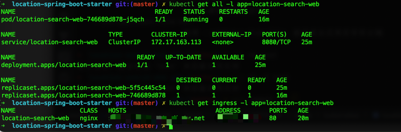

## 免费的 Spring Boot 地址插件

这里实现两种方式

- ip2region: 国内快速的IP检索器。
- GeoIP：国外产品，全球的IP地址库，免费的不完善，完善的要钱。

### ip2region 的 xdb 下载地址

您可以在以下链接下载 `ip2region.xdb` 文件：

[下载地址](https://github.com/lionsoul2014/ip2region/blob/6ed8bf011875208cdad30c90b08aaff45062c674/data/ip2region.xdb)

要使用此插件，请将以下依赖添加到您的 Maven 项目的 `pom.xml` 文件中：

```xml
<dependency>
    <groupId>com.fc</groupId>
    <artifactId>ip2region-spring-boot-starter</artifactId>
    <version>1.0-SNAPSHOT</version>
</dependency>
```

然后，在您的应用程序的 YAML 配置文件中指定 `ip2region.xdb` 文件的路径：

```yaml
ip2region.xdb: /path/to/ip2region.xdb
```

如果您在 Kubernetes 中使用此插件，建议您将 `ip2region.xdb` 文件挂载为 NTFS 卷。

要使用该插件，您可以使用以下代码示例：

```java
try (var ctx = SpringApplication.run(Main.class, args)) {
    IP2RegionService ip2RegionService = ctx.getBean(IP2RegionService.class);

    // 输出示例：LocationInfo{country='中国', region='0', province='广东省', city='深圳市', isp='电信'}
    System.out.println(ip2RegionService.getIpLocation("183.15.156.42"));
}
```

### GeoIP 的数据包下载地址

您可以在以下链接下载 GeoIP 数据包，需要使用电子邮件登录：

下载页面：
[下载页面](https://www.maxmind.com/en/accounts/421403/geoip/downloads)

下载地址：
[下载地址](https://download.maxmind.com/app/geoip_download_by_token?edition_id=GeoLite2-City&date=20230822&suffix=tar.gz&token=v2.local.ryDCXCVi4mr35rnttZkZwB2kyx8yw3r2yKUzth7kwgCBRv8PAMKxzX-o1mnzPVpgcILzz5-PpenYmIC-bMl_j9cEkGiXwhfba_-PqEeQUiuLmPkgdNw5qSL3u5asmAyNBtYK7V-WmVQ9YhwJz5TizaW4kwhLbOvrLOVCvUTyND8dme-97xpHBFMo58a6EWWouyjx5A)

要使用 GeoIP 插件，请将以下依赖添加到您的 Maven 项目的 `pom.xml` 文件中：

```xml
<dependency>
    <groupId>com.fc</groupId>
    <artifactId>geoip-spring-boot-starter</artifactId>
    <version>1.0-SNAPSHOT</version>
</dependency>
```

然后，在您的应用程序的 YAML 配置文件中指定 `GeoLite2-City.mmdb` 文件的路径：

```yaml
geoip2.mmdb: /path/to/GeoLite2-City.mmdb
```

要使用该插件，您可以使用以下代码示例：

```java
try (var ctx = SpringApplication.run(Main.class, args)) {
    GeoIP2Service geoIP2Service = ctx.getBean(GeoIP2Service.class);

    // 输出示例：GeoIP2Info{country='中国', province='广东', city='深圳', latitude=22.5559, longitude=114.0577}
    System.out.println(geoIP2Service.getLocationInfo("183.15.156.42"));
}
```


## 基于K8s部署例子
```bash
1. 第一步编译打包
mvn clean install

2. 进入到web项目
cd location-search-web

3. 到成镜像包, allen2fuc是自己的hub的镜像仓库
mvn k8s:build 

4. 上传到dockerhub
mvn k8s:push

5. 生成k8s资源文件, 并且部署到k8s
mvn k8s:resource k8s:apply
```


## 测试
```bash
http {{SERVER_IP}}/location "ip==183.15.156.42"
或者
curl "{{SERVER_IP}}/location?ip=183.15.156.42"
```